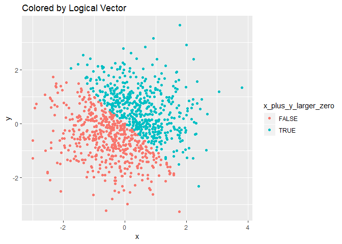
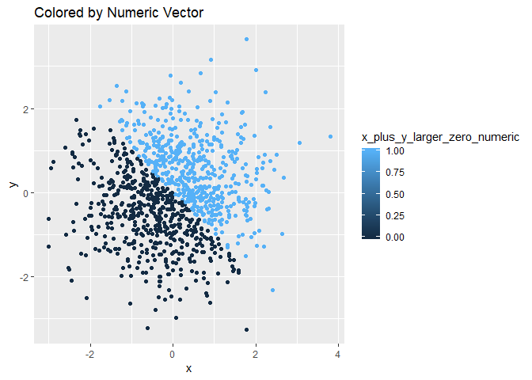
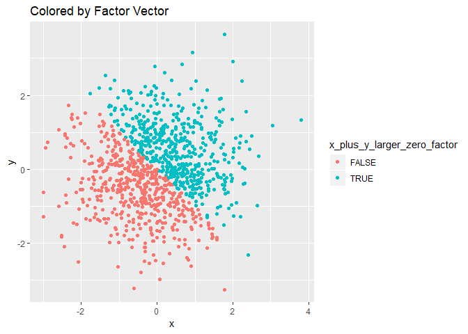

P8105 Homework 1
================
Alina Levine

``` r
library(tidyverse)
```

    ## -- Attaching packages -------------------------------------------------------------------- tidyverse 1.2.1 --

    ## v ggplot2 3.0.0     v purrr   0.2.5
    ## v tibble  1.4.2     v dplyr   0.7.6
    ## v tidyr   0.8.1     v stringr 1.3.1
    ## v readr   1.1.1     v forcats 0.3.0

    ## -- Conflicts ----------------------------------------------------------------------- tidyverse_conflicts() --
    ## x dplyr::filter() masks stats::filter()
    ## x dplyr::lag()    masks stats::lag()

``` r
library(ggplot2)
```

Problem 1
=========

Create Vectors
--------------

I am creating a random sample of size 10 from the uniform distribution and will make a logical vector indicating which elements are greater than 2. I will also create a factor vector and character vector

``` r
uniform_sample_vector = runif(10, 0, 5)

greater_than_two = uniform_sample_vector > 2

factor_vector = as.factor(c("a", "a", "a", "a", "a", "a", "b", "b", "b", "b"))

character_vector = c("a", "b", "c", "d", "e", "f", "g", "h", "i", "j")
```

Mean of Vectors
---------------

When I take the mean of these vectors, I get a number back for the logical and numeric vctors, but I get NA for the factor and character vectors. This is because mean() treats the logical vector as numeric, giving TRUE a value of 1 and FALSE a value of 0, but it does not do this with character vectors

``` r
mean(uniform_sample_vector)
mean(greater_than_two)
mean(factor_vector)
```

    ## Warning in mean.default(factor_vector): argument is not numeric or logical:
    ## returning NA

``` r
mean(character_vector)
```

    ## Warning in mean.default(character_vector): argument is not numeric or
    ## logical: returning NA

Converting to Numeric
---------------------

When I apply as.numeric to the logical vector, I get a vector of 1s and 0s return When I apply as.numeric to the factor vector, I get a vector of 1 and 2, each number corresponding to a level. I get NAs when I apply as.numeric to a character vector

``` r
as.numeric(greater_than_two)
as.numeric(factor_vector)
as.numeric(character_vector)
```

    ## Warning: NAs introduced by coercion

When I convert my character vector to a factor and then to numeric I get a numeric vector 1:10 because the character vector had 10 unique entries, so there were 10 levels. When I convert my factor vector to a character vector to a numeric vector I get NAs because character vectors cannot be converted to numeric vectors

``` r
as.numeric(as.factor(character_vector))
as.numeric(as.character(factor_vector))
```

    ## Warning: NAs introduced by coercion

Problem 2
=========

Create Data Frame
-----------------

``` r
set.seed(1)

plot_df = tibble(
  x = rnorm(1000),
  y = rnorm(1000),
  x_plus_y_larger_zero = (x + y) > 0,
  x_plus_y_larger_zero_numeric = as.numeric(x_plus_y_larger_zero),
  x_plus_y_larger_zero_factor = as.factor(x_plus_y_larger_zero)
)
```

There are 5 columns and 1000 rows.
The mean of x is -0.0116481 and the median of x is -0.0353242
The proportion of cases for which x\_plus\_y\_larger\_zero is TRUE is 0.49

Scatter Plots
-------------

I get the same result when I color by a factor and by a logical vector. When I color by a numerical vector the only difference I see is that the legend shows a gradient of color going from 0 to 1 because the numbers in the vectors range from 0 to 1 since FALSE gets 0 and TRUE gets 1

``` r
ggplot(plot_df, aes(x = x, y = y, color = x_plus_y_larger_zero)) + labs(title = "Colored by Logical Vector") + geom_point()
```



``` r
ggplot(plot_df, aes(x = x, y = y, color = x_plus_y_larger_zero_numeric )) + labs(title = "Colored by Numeric Vector") + geom_point()
```



``` r
ggplot(plot_df, aes(x = x, y = y, color = x_plus_y_larger_zero_factor )) + labs(title = "Colored by Factor Vector") + geom_point()
```


